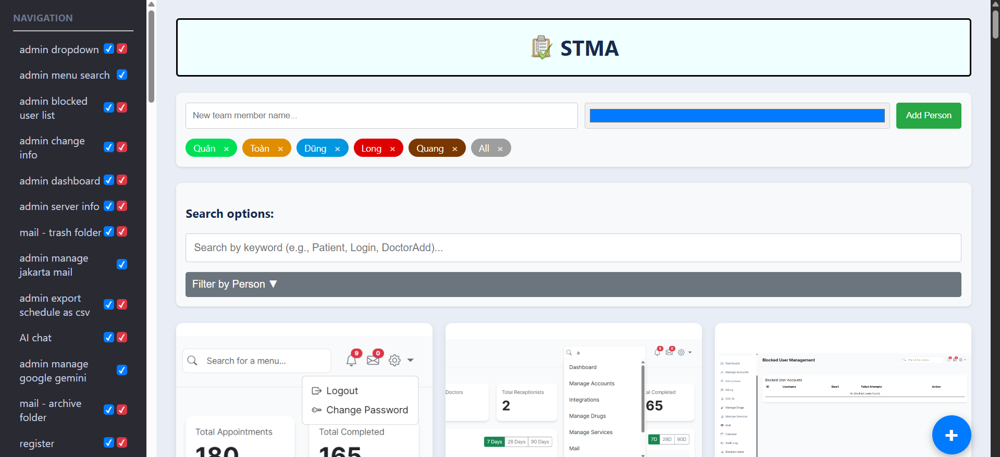
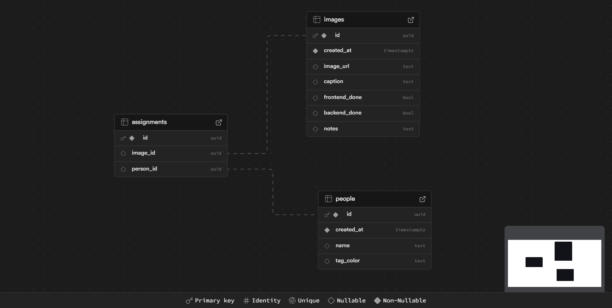

# **App lập kế hoạch thiết kế app cho nhóm 3**

**Các chức năng chính:**

> **File images cho UI của project:** chi tiết hình ảnh cho UI của project

> **Công nghệ sử dụng:** Coding with AI support

> Use vanilla JavaScript with Vite serverless build using Node 22.x runtime, connects to Supabase Postgres (handled all the db jobs)
> Track the frontend/backend progress of each screen, take notes, assign a person to each screen, filter by person, title etc.
---

* Template source: **[Full EMR (Electronic Medical Records)](https://drapcode.com/templates/electronic-medical-records-emr)**

> **App hoàn chỉnh**
<h3 align="center">
    
<h3>

> **Database schema**
<h3 align="center">
    
<h3>

---

## Logs
### GUI Improvements - patch 2.1.1 Sep 30 2025 8:11PM
- improve a bit gui display

### New search function - patch 2.1.0 Sep 30 2025 7:27PM
- there are 2 search function: title-based and person-tag-based
- title search support: PascalCase, camelCase, snake_case, kebab-case, Regular text splitted by spaces
- the title saerch is not perfect and still has some unfixed bug like `ad -> add and ad` that's annoying but I'll fix that later on the future patches
- tag search: search one or mor person tag combined like google sheet filter (the fact is that I'm also using filter to do so)
- user can combine both search options together and it should work.

### MAJOR APP REBASE - Huge Update V2.0.0 Sep 30 2025 6:47PM
- add new favions
- refactored the favions to assets folder
- add src folder
- *divide and conquer: huge rebase split scipt.js into smaller modules for better maintaining (will be in ./assets/src and ./assets/src/components)*
- `DBClient.js` : very similar to DBContext.java in servlet using this to connect to postgres
- `api.js` : fetch data from postgres
- `main.js` : the app endpond to finally get everything works together
- `handler.js` : managing action, do things and catch exception
- `lightbox.js` : the lightbox functions
- `state.js` : shared application state. Holds data that is fetched once and then used
- `ui.js` : generate dynamic html content for the page
- delete script.js cause we dont need it anymore

### More flexible uploads & Notes section patch 1.0.2 Sep 17 2025 7:21PM
- add multiple image uploads
- user can now edit the title of the image by clicking on the title
- add notes section
- fix side navigation bar text overflow
- add available note's button status to green

---

### Improved image upload patch 1.0.1 Sep 17 2025 2:19PM
- set default title value as the original image name

---

### Back-end version RELEASE 1.0.0 Sep 16 2025 10:27PM
- add synch checkbox for fun
- add option to delte the image if needed
- fixed the delete function not work

---

### Back-end version snapshot3 Sep 16 2025 at 8:00PM
**HASTA LA VISTA BUG BABIES FINALY**

- in db add one more column within the `person` table which is `tag_color` and set the default value to `#cccccc`
- add person tags which you can add or remove a person in a project
- add a function which you can assign a person to do a section with the image
- fixed the bug where the tag color doesnt set properly
- fixed a bug where you cant assigh person into an image section
- db connect completed
- fix add images not work bug
- fix the lightbox bug
- add zoom in/out and panning for each lightbox

---

### Back-end version snapshot2 Sep 16 2025 at 6:58PM
- since the backend styling looks sh*t, merge the previous front end version
- fix grid view mode

---

### Back-end version snapshot1 Sep 16 2025 at 6:28PM
- successfuly connected to postgres
- add option to track front end and back end complete or not
- moving to a more modern version to import lib for db
- config policies for the table `person`, `images`, `assignments` for public use
- config the storage policies Allow public uploads and view

---

### Front-end version prototype done on Sep 16 2025 at 4:40PM
- fix various bug and display issues
- populate the image hard-coded into the html file
- ready for the next phase with the completed front end stuff

---